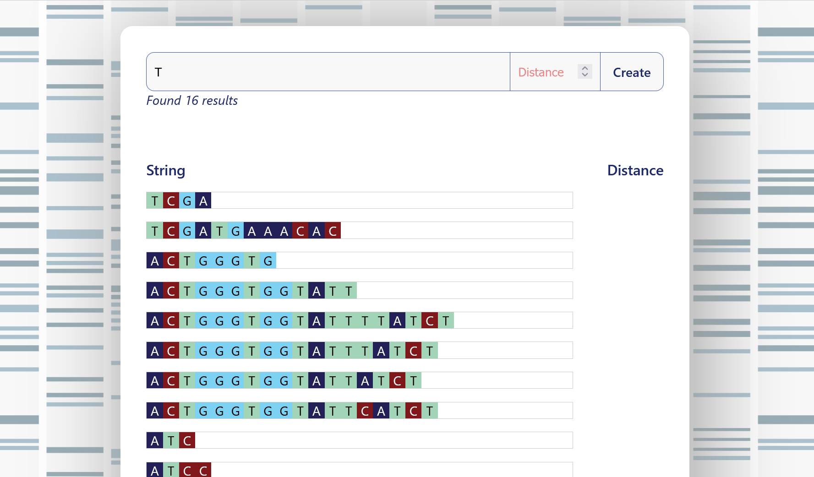

# ENPICOM Software Engineer Technical Assessment

## Brief

Hello there! If you have been asked to complete this technical assessment, that means we
believe you are a promising candidate for one of our open vacancies.

We have provided you with a working template project, to save some time.
Of course if you prefer, feel free to delete the files and start from scratch.

You might have to make assumptions about the requirements, please write them down.
Please fork this repository, push your implementation and provide us with the link when you're finished.

Here's what we would like you to do:

### Server

Design and implement a REST API in TypeScript that exposes 2 endpoints:

- ✅ Adding a DNA string (DNA strings consist of `ACTG` letters)
- ✅ Searching for DNA strings, allowing an ✅ optional parameter for [Levenshtein distance](https://en.wikipedia.org/wiki/Levenshtein_distance) between search and match.

✅ Both endpoints should validate their inputs. ✅ Both endpoints should also be tested.
✅ Data should be persisted in a PostgreSQL database.

### Client

✅ Design and implement a SPA in TypeScript + React that allows a user to interact with the above API
through their browser.

## Result

In this repo you find the implementation of the above brief. It is a DNA browser which easily allows you to search DNA strings and add them when they do not exist in the database:

### How to run

1. First, install the dependencies `npm --prefix client ci` && `npm --prefix client ci`

#### Prod

2. Build the react frontend `npm --prefix client run build`
3. Run `docker-compose -f docker-compose.prod.yml up`
4. Go to http://localhost:3001/
5. `docker-compose -f docker-compose.prod.yml down` when you're done

#### Dev

2. Run `docker-compose -f docker-compose.dev.yml up`
3. Wait some time (development is quite slow with react-scripts)
4. Go to http://localhost:3000/
5. `docker-compose -f docker-compose.dev.yml down` when you're done

### Run Tests for the React frontend

1. `npm --prefix client run test`

NOTE: This command currently just spawns the db and server docker containers to make the api available. In the future, API calls can best be mocked.

### Run Tests for the NodeJS backend

1. `npm --prefix server run test`

NOTE: This command currently spawns the database docker container to make data available. In the future, a db can best be mocked.

## Open Question

Suppose you had to turn the above components into a production web application consumed by many concurrent users and
handling large volumes of data. What would you have to change/improve in order to achieve that?

### Answer

- This assignment is of course limited in execution. The Levenshtein extension of Postgres only allows source and match strings of 255 characters, which in reality doesn't make sense for DNA sequences.
- Ideally DNA sequences are first compressed by an algorithm to reduce size. A hash should also be calculated to easily identify duplicate entries.
- While Postgres is great, raw DNA sequences could also be put in a NoSQL DB like Dynamo. Perhaps even chunked per 1,000 bases.
- Adding DNA sequences one by one is of course insufficient. Data ingestion, depending on the scenario, would be done by batch file import.
- Fuzzy string match probably isn't the only operation you want to execute on the data. More computations are probably needed.
- It would be advisable to maintain a headless architecture and seperate all elements. Frontend <-> Gateway (Auth/Route/etc) <-> Services(+) <-> DB(+)
- If, following the context of this example application, functionality is read-intensive, a (Redis) caching layer could also be put in front of the DB to speed up common queries.
- Depending on the load (concurrent connections / computational effort), kubernetes could be used to scale the various layers.
